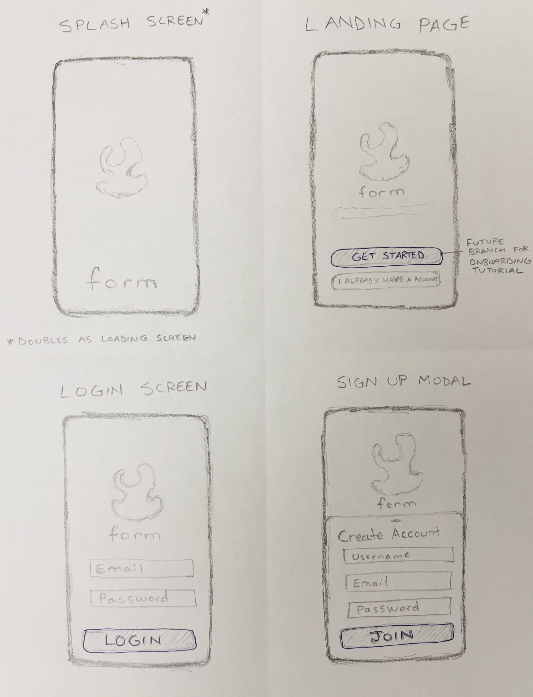
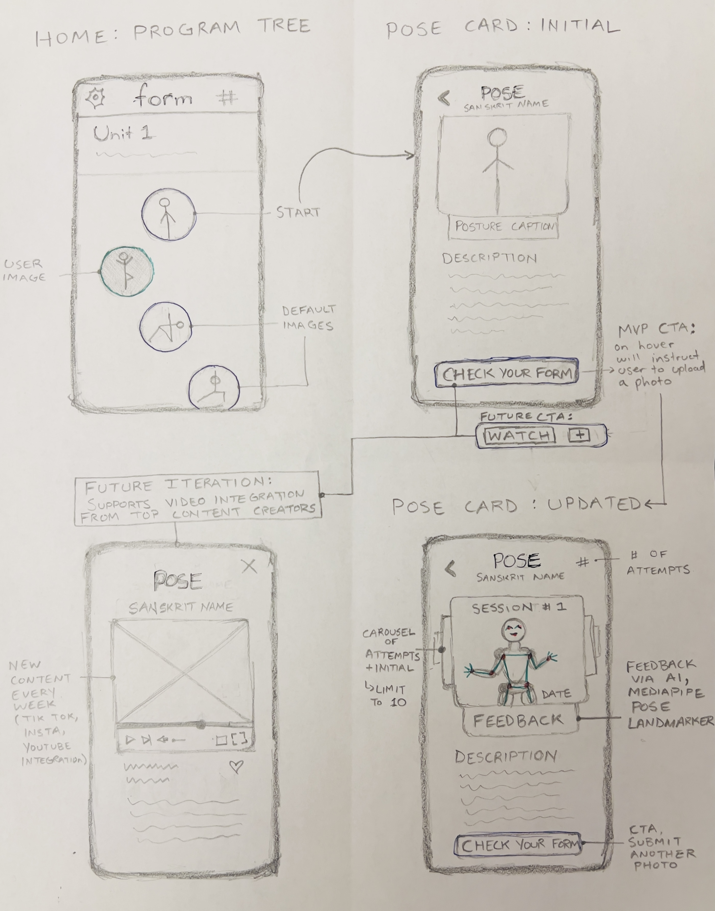
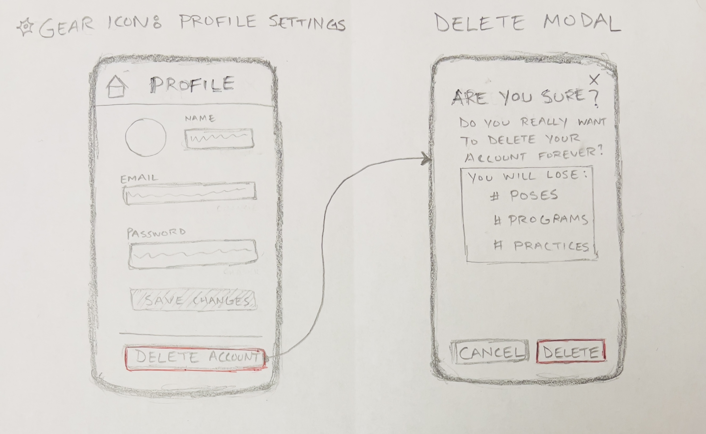
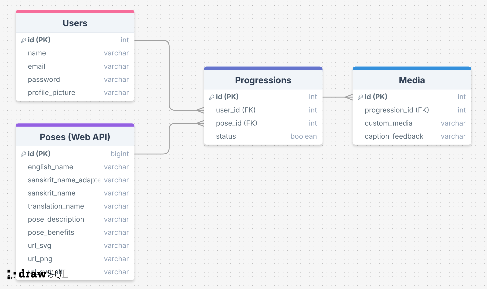

# 🤸 Form: Master Movement

---

<p align="center">
  <strong>How might we</strong> make learning and mastering physical movements more accessible, engaging, and affordable through gamification and AI-powered feedback?
</p>

---

## 📖 Overview

Form is a **gamified fitness app** designed to make learning and mastering physical movements enjoyable and interactive. Inspired by apps like _Duolingo_ and _CodeSignal_, it offers a **progressive "tree path"** of poses and activities across disciplines like yoga, calisthenics, and dance. Users can learn poses, upload images to evaluate their form, and track their progress visually. With integrated features for **AI-powered posture feedback**, Form helps users grow from beginner to expert in their chosen disciplines.

---

## 🚧 Problem Space

Mastering physical movements like yoga, dance, or calisthenics is challenging due to high costs (despite minimal equipment), lack of feedback, and inconsistent practice. **Beginners** often feel **intimidated**, while experienced users **struggle to track progress** or **refine technique affordably**. Form solves these issues with gamified guidance, progress tracking, and personalized feedback.

---

## 👤 User Profile

1. **Beginners**: Unlock foundational skills through step-by-step guidance and clear progress paths.

2. **Intermediate Practitioners**: Refine form by uploading photos/videos for feedback.

3. **Experts**: Showcase skills and track achievements visually.

4. **Cost-Conscious Movers**: Access affordable learning without equipment or subscription barriers.

5. **Habit Builders**: Build consistent routines with streak tracking and gamification.

---

## 🌟 Features

| **Feature**             | **User Goals**                                                                                                                                                                                                                                  |
| ----------------------- | ----------------------------------------------------------------------------------------------------------------------------------------------------------------------------------------------------------------------------------------------- |
| **Account Management**  | - Create an account to save and personalize progress.<br/>- Log in to access saved progress and settings.<br/>- Delete an account to remove personal data and progress.                                                                         |
| **Progress Tree**       | - Explore a visually engaging tree path of poses to stay motivated and track progress.<br/>- View completed and uncompleted nodes to identify next steps.<br/>- Progress at your own pace, unlocking new challenges for a sense of achievement. |
| **Pose Cards**          | - Access detailed instructions and visuals for step-by-step learning.<br/>- Upload photos of pose attempts to track progress and personalize visuals on the progress tree.                                                                      |
| **AI-Powered Feedback** | - Upload a photo of a pose to receive alignment feedback, improving technique and avoiding injuries.                                                                                                                                            |
| **Practice Tracking**   | - Receive daily movement prompts for consistent practice and momentum.<br/>- Track attempts per pose and total completed poses to measure progress over time.                                                                                   |

## 🖥️ Implementation

### 🛠 Tech Stack

#### **Frontend**

- **React**: Frontend framework for interactive UI.
- **SCSS**: Modular and reusable styling.

- **react-router-dom**: For page navigation.
- **axios**: Handles API calls.
- **sass**: Streamlines advanced styling.
- **Mediapipe**: AI posture analysis (npm i @mediapipe/pose styled-components)

#### **Backend**

- **Node.js + Express**: Efficient server-side environment and API framework.
- **Knex.js**: Query builder for database management.
- **MySQL**: Database for structured storage.

- **express-fileupload**: Handles file uploads.
- **dotenv**: Protects environment variables.
- **cors**: Enables secure cross-origin requests.

#### **Hosting & Deployment**

- **Heroku**: Backend and API hosting.
- **Netlify**: Frontend hosting for React applications.
- **Porkbun**: Featured on portfolio's domain.

---

## 🔗 APIs

1. **Yoga Pose API** ([Yoga API by Alex Cumplido](https://github.com/alexcumplido/yoga-api)):

   - A free database of yoga poses with detailed descriptions, images, and benefits.
   - _Usage_: Preloaded yoga pose data for initializing the app's tree nodes and pose cards.
   - _Limitations_: Limited to yoga poses; future expansion to other disciplines (e.g., dance or calisthenics) will require additional data sources or manual input.

2. **MediaPipe API** ([MediaPipe Pose Landmarker](https://ai.google.dev/edge/mediapipe/solutions/vision/pose_landmarker)):

   - Provides pre-trained pose estimation models for detecting and analyzing user posture.
   - _Usage_: Used to identify body landmarks and assess alignment for AI-powered feedback on poses (e.g., "Standing" vs. "Sitting").
   - _Limitations_: Accuracy depends on image quality and may struggle with non-standard lighting or camera angles.

## 🗺️ Sitemap

- Splash screen
- Landing Page + Sign Up Modal
- Login Page
- Home page (i.e. tree path)
- Pose card
- Profile Settings + Delete Modal

```plaintext
client/
├── public/
│   └── Assets/
├── src/
│   ├── components/
│   │   ├── Splash.jsx
│   │   ├── SignUpModal.jsx
│   │   ├── DeleteModal.jsx
│   │   ├── NavBar.jsx              # Component for styling NavBar on HomePage and Profile settings
│   │   ├── Tree.jsx                # Component to visualize and manage the progress tree
│   │   ├── TreeBranch.jsx          # Component to visualize and manage the branches (units) of the tree
│   │   ├── TreeNode.jsx            # Component to visualize and manage the nodes of the tree
│   │   ├── PoseCardWidget.jsx      # Component for displaying pose instructions and user-uploaded media
│   │   └── PoseEvaluation.jsx      # Component for pose evaluation and image carousel with dynamic feedback
│   ├── pages/
│   │   ├── SplashScreen.jsx
│   │   ├── LandingPage.jsx         # Landing page with get started or login options, includes signup modal
│   │   ├── LoginPage.jsx           # Login page for user authentication
│   │   ├── HomeTree.jsx            # Main page showing the user's tree path
│   │   ├── PoseCard.jsx            # Signup page for new users
│   │   └── ProfileSettings.jsx     # Profile settings, includes account deletion option and modal
│   ├── services/
│   │   ├── api.js                  # Manages API calls between the frontend and backend
│   │   └── mediapipeServ.js        # Handles Mediapipe integration for AI posture feedback
│   ├── styles/
│   │   ├── \_variables.scss
│   │   ├── \_mixins.scss
│   │   ├── \_global.scss
│   │   └── \_typography.scss
│   ├── App.jsx
│   ├── index.scss
│   └── main.jsx
├── vite.config.js
├── eslint.config.js
├── .env.example
├── .gitignore
├── package.json
└── package-lock.json

```

```plaintext
server/
├── controllers/
│   ├── authController.js           # Handles authentication logic (e.g., login, signup)
│   ├── poseController.js           # Manages CRUD operations for poses
│   ├── progressionController.js    # Handles user progression tracking and updates
│   └── mediaController.js          # Handles CRUD operations for media files (e.g., upload, fetch, delete)
├── routes/
│   ├── authRoutes.js               # API routes for user authentication
│   ├── poseRoutes.js               # API routes for fetching and managing pose data
│   ├── progressionRoutes.js        # API routes for tracking and updating progressions
│   └── mediaRoutes.js              # API routes for managing media files
├── models/
│   ├── User.js                     # Database model for user accounts and profile data
│   ├── Pose.js                     # Database model for poses (e.g., name, difficulty, media links)
│   ├── Progression.js              # Database model for tracking user progress for each pose
│   └── Media.js                    # Database model for managing uploaded media files
├── db/
│   ├── dbConfig.js                 # MySQL database connection configuration
│   ├── migrations/                 # Database schema migrations (e.g., creating tables)
│   │   ├── create_users_table.js   # Migration for the Users table
│   │   ├── create_progressions_table.js # Migration for the Progressions table
│   │   └── create_media_table.js   # Migration for the Media table
│   └── seeds/                      # Seed files to populate database with initial data
│       ├── seed_users.js           # Seed data for users
│       └── seed_media.js           # Seed data for media
├── uploads/                        # Folder for storing user-uploaded media files
├── middleware/
│   └── multerConfig.js             # Middleware configuration for handling file uploads (e.g., express file upload)
├── server.js                       # Main entry point for starting the backend server
├── .env.example                    # Example environment variables configuration
├── .gitignore                      # List of files and directories to ignore in version control
├── package.json                    # NPM package metadata and scripts
└── package-lock.json               # NPM dependency lock file


```

## 🖼️ Mockups





## 🗄️ Data and Relationships:



## 📬 Endpoints

#### **Users Endpoints**

1. **Register a New User**

   - **URL**: `/api/users/register`
   - **Method**: `POST`
   - **Status Code**: `201 Created`
   - **Request Body**:
     ```json
     {
       "name": "Betty Alemayehu",
       "email": "betty@example.com",
       "password": "securepassword"
     }
     ```
   - **Response**:
     ```json
     {
       "message": "User registered successfully",
       "user": {
         "id": 1,
         "name": "Betty Alemayehu",
         "email": "betty@example.com"
       }
     }
     ```

2. **Login User**

   - **URL**: `/api/users/login`
   - **Method**: `POST`
   - **Status Code**: `200 OK`
   - **Request Body**:
     ```json
     {
       "email": "betty@example.com",
       "password": "securepassword"
     }
     ```
   - **Response**:
     ```json
     {
       "message": "Login successful"
     }
     ```

3. **Get User Profile**

   - **URL**: `/api/users/profile`
   - **Method**: `GET`
   - **Status Code**: `200 OK`

   - **Response**:
     ```json
     {
       "id": 1,
       "name": "Betty Alemayehu",
       "email": "betty@example.com",
       "profile_picture": "https://example.com/images/profile.jpg"
     }
     ```

4. **Delete User Profile**
   - **URL**: `/api/users/profile`
   - **Method**: `DELETE`
   - **Status Code**: `204 No Content`
   - **Response**:
     No response body.

---

#### **Poses Endpoints**

5. **Get All Poses**

   - **URL**: `/api/poses`
   - **Method**: `GET`
   - **Status Code**: `200 OK`
   - **Response**:
     ```json
     [
       {
         "id": 5,
         "english_name": "Butterfly",
         "sanskrit_name_adapted": "Baddha Konasana",
         "sanskrit_name": "Baddha Koṇāsana",
         "translation_name": "baddha = bound, koṇa = angle, āsana = posture",
         "pose_description": "In sitting position, bend both knees and drop the knees to each side, opening the hips.  Bring the soles of the feet together and bring the heels as close to the groin as possible, keeping the knees close to the ground.  The hands may reach down and grasp and maneuver the feet so that the soles are facing upwards and the heels and little toes are connected.  The shoulders should be pulled back and no rounding of the spine.",
         "pose_benefits": "Opens the hips and groins.  Stretches the shoulders, rib cage and back.  Stimulates the abdominal organs, lungs and heart.",
         "url_svg": "https://res.cloudinary.com/dko1be2jy/image/upload/fl_sanitize/v1676483074/yoga-api/5_i64gif.svg",
         "url_png": "https://res.cloudinary.com/dko1be2jy/image/upload/fl_sanitize/v1676483074/yoga-api/5_i64gif.png",
         "url_svg_alt": "https://www.dropbox.com/s/3h2pts6xbn28dh7/butterfly%3F.svg?raw=1"
       }
     ]
     ```

6. **Get Pose by ID**

   - **URL**: `/api/poses/:id`
   - **Method**: `GET`
   - **Status Code**: `200 OK`
   - **URL Parameters**:
     - `id` (integer): The ID of the pose.
   - **Response**:
     ```json
     {
       "id": 5,
       "english_name": "Butterfly",
       "sanskrit_name_adapted": "Baddha Konasana",
       "sanskrit_name": "Baddha Koṇāsana",
       "translation_name": "baddha = bound, koṇa = angle, āsana = posture",
       "pose_description": "In sitting position, bend both knees and drop the knees to each side, opening the hips.  Bring the soles of the feet together and bring the heels as close to the groin as possible, keeping the knees close to the ground.  The hands may reach down and grasp and maneuver the feet so that the soles are facing upwards and the heels and little toes are connected.  The shoulders should be pulled back and no rounding of the spine.",
       "pose_benefits": "Opens the hips and groins.  Stretches the shoulders, rib cage and back.  Stimulates the abdominal organs, lungs and heart.",
       "url_svg": "https://res.cloudinary.com/dko1be2jy/image/upload/fl_sanitize/v1676483074/yoga-api/5_i64gif.svg",
       "url_png": "https://res.cloudinary.com/dko1be2jy/image/upload/fl_sanitize/v1676483074/yoga-api/5_i64gif.png",
       "url_svg_alt": "https://www.dropbox.com/s/3h2pts6xbn28dh7/butterfly%3F.svg?raw=1"
     }
     ```

---

#### **Progressions Endpoints**

7.  **Get User Progressions**

    - **URL**: `/api/progressions`
    - **Method**: `GET`
    - **Status Code**: `200 OK`
    - **Response**:

      ```json
      [
        {
          "id": 1,
          "pose_id": 5,
          "status": "Completed"
        },
        {
          "id": 2,
          "pose_id": 8,
          "status": "In Progress"
        }
      ]
      ```

8.  **Update User Progression**

    - **URL**: `/api/progressions/:id`
    - **Method**: `PATCH`
    - **Status Code**: `200 OK`
    - **URL Parameters**:
      - `id` (integer): The ID of the progression to update.
    - **Request Body**:
      ```json
      {
        "status": "Completed"
      }
      ```
    - **Response**:
      ```json
      {
        "message": "Progression updated successfully",
        "progression": {
          "id": 2,
          "status": "Completed"
        }
      }
      ```

---

#### Media Endpoints

9.  **Get Media to Progression**

    - **URL**: `/api/media/:progressionId`
    - **Method**: `GET`
    - **Status Code**: `200 OK`
    - **URL Parameters**:
      - `progressionId` (integer): The ID of the progression.
    - **Response**:

      ```json
      [
        {
          "id": 1,
          "progression_id": 2,
          "custom_media": "https://example.com/uploads/media1.jpg",
          "caption_feedback": "Great posture!"
        },
        {
          "id": 2,
          "progression_id": 2,
          "custom_media": "https://example.com/uploads/media3.jpg",
          "caption_feedback": "Try to keep your back straight."
        }
      ]
      ```

10. **Add Media to a Progression**

    - **URL**: `/api/media`
    - **Method**: `POST`
    - **Status Code**: `201 Created`
    - **Request Body**:

      ```json
      {
        "progression_id": 2,
        "custom_media": "https://example.com/uploads/media3.jpg",
        "caption_feedback": "Try to keep your back straight."
      }
      ```

    - **Response**:

      ```json
      {
        "message": "Media added successfully",
        "media": {
          "id": 3,
          "progression_id": 2,
          "custom_media": "https://example.com/uploads/media3.jpg",
          "caption_feedback": "Try to keep your back straight."
        }
      }
      ```

11. **Delete Media**

    - **URL**: `/api/media/:id`
    - **Method**: `Delete`
    - **Status Code**: `204 No Content`
    - **URL Parameters**:
      - `id` (integer): The ID of the media entry to delete.
    - **Response**: No response body

---

## 🛤️ Roadmap

[Gantt Chart](https://betelhema.notion.site/0e13b728d6b94434be1694f5786f25ed?v=144fcff3186780b1b0df000c4304e98b)
[Kanban Board](https://betelhema.notion.site/0e13b728d6b94434be1694f5786f25ed?v=144fcff3186780abb3bf000cbe89cbe0)

### Setup

- Submit proposal and refine project plan.
- Create React project with routes and boilerplate pages.
- Set up Express server with routing and placeholder responses.
- Initialize MySQL database with schema and migrations.

### Frontend Development

- **Splash Page**: Create splash screen with tagline and "Get Started" button.
- **Landing Page**: Build sign-up modal and navigation to login page.
- **Login Page**: Implement login form with dummy data validation.
- **Home Tree**: Design progress tree with hardcoded nodes.
- **Pose Cards**: Add cards for pose details and media upload.

### Backend Development

- **Authentication**:
  - Create `/users/register` and `/users/login` endpoints.
- **User Profile**:
  - Implement GET `/users/profile` and DELETE `/users/profile` endpoints.
- **Poses API**:
  - Add `/poses` and `/poses/:id` endpoints for pose data.
- **Progressions API**:
  - Implement `/progressions` for tracking progressions.
  - Add PATCH `/progressions/:id` and POST `/progressions/:id/media` endpoints.

### Integration

- Integrate Mediapipe API for pose evaluation.
- Connect frontend components to backend APIs.

### Testing & Refinement

- Test and debug all API endpoints with Postman.
- Perform end-to-end testing for all app functionality.

### Demo Day

---

## 🛠 Future Features

| **Feature**                            | **Details**                                                                                                                                                                                                                                              |
| -------------------------------------- | -------------------------------------------------------------------------------------------------------------------------------------------------------------------------------------------------------------------------------------------------------- |
| **1. Cloud-Based Media Storage**       | - Transition to AWS S3 or Cloudinary.<br/>**Benefits:** Scalability, improved security, seamless access for mobile and web users.                                                                                                                        |
| **2. Streak Rewards**                  | Introduce streak-based incentives:<br/> - Milestone badges (e.g., 7-day, 30-day streaks).<br/> - Unlockable themes or customizations for progress trees.                                                                                                 |
| **3. Progress Analytics**              | Provide insights into activity:<br/> - Streak history, pose completion rates.<br/> - Suggestions for improving consistency and performance.                                                                                                              |
| **4. Social Features**                 | Enable users to:<br/> - Connect with friends, share progress, and give feedback.<br/> - Join group challenges and collaborative achievements.                                                                                                            |
| **5. Cross-Discipline Pose Libraries** | - Add pose categories for dance, calisthenics, and other disciplines.<br/>- Provide tailored progress trees (e.g., "Flexibility Boost").                                                                                                                 |
| **6. Mobile App Deployment**           | - Develop a React Native app:<br/> - Push notifications for streak reminders.<br/> - Offline access to pose cards for on-the-go practice.                                                                                                                |
| **7. Advanced AI Feedback**            | Expand Mediapipe integration for:<br/> - Real-time pose corrections.<br/> - Dynamic posture assessments for advanced poses.</br>- Address potential issues with pose evaluation accuracy (e.g., lighting, camera angle) in the roadmap and future plans. |
| **8. Custom User Avatars**             | - Allow users to create avatars representing progress.<br/> - Unlock avatar upgrades via streaks or pose milestones.                                                                                                                                     |
| **9. Onboarding Tutorial**             | - Integrated onboarding tutorial for new users.                                                                                                                                                                                                          |

---

## 🔮 Prioritization of Future Features

The **post-MVP focus** will prioritize:

- **Cloud-based media storage** for enhanced scalability and user experience.

Shorter-term features like **streak rewards** and **progress analytics** may be introduced earlier to drive user engagement. Long-term goals include **AI feedback** and **mobile app deployment** to solidify the app as a cutting-edge solution (React Native).

This phased development ensures innovation, adaptability, and user satisfaction.

---

## ⚠️ Potential Risks:

- **Engagement Plateau:** Gamification might lose its novelty over time. Adding incentives like streak rewards or unlockable themes can help sustain user interest.
- **AI User Trust:** Users may distrust AI feedback if it feels too robotic or inaccurate. Include disclaimers and simple, constructive guidance to build trust.
